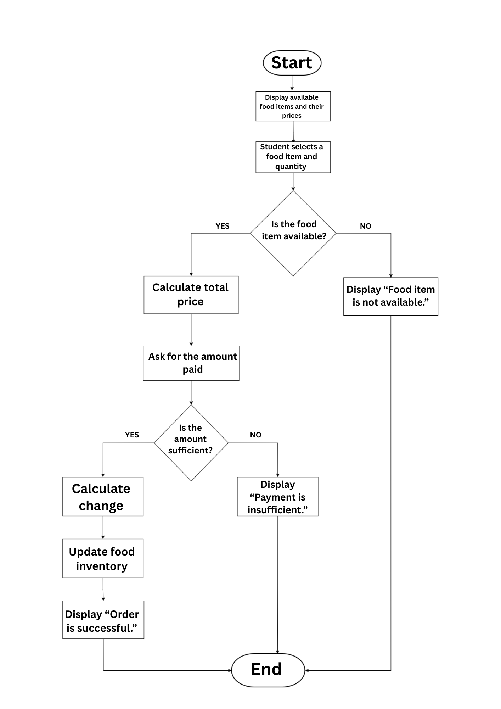

## Step 1: Identify the Big Problem

The PSHS school canteen has a slow lunch queue because students
take too long in deciding what to buy, cashiers manually calculate totals and
change, and there is no system for monitoring food items that are running out.

## Step 2: Identify three to four Sub-Problems

1. Students take too long to decide what to buy or order.
2. Cashiers manually calculate the total cost and change.
3. The canteen has no system for monitoring food inventory.
4. Students experience long waiting times.

## Step 3: Define Computational Thinking Approaches

| Sub-Problem | CT Skill | Example Solution |
|---|---|---|
| Students take too long to decide what to buy or order. | Abstraction | Display a simple menu that shows the available foods with  prices. |
| Cashiers manually calculate totals and change. | Algorithm Design | Automatically calculate the total and change based on the selected items and payment. |
| The canteen has no system for monitoring food inventory. | Pattern Recognition | Track purchased items to identify which foods may run out quickly. |
| Students experience long waiting times. | Decomposition | Divide the ordering process into smaller steps that can be improved individually. |

## Step 4: Flowchart
The flowchart shows the Smart School Canteen ordering process, including food availability, payment, change, and inventory updating.

## Reflection / Explanation

Decomposition helps solve the canteen problem by breaking one large and
complicated problem into smaller parts that are easier to understand and solve.

The CT skills used are decomposition, abstraction, pattern recognition, and
algorithm design. These skills can make the canteen process more organized,
potentially reduce waiting time, and help both students and canteen staff.
